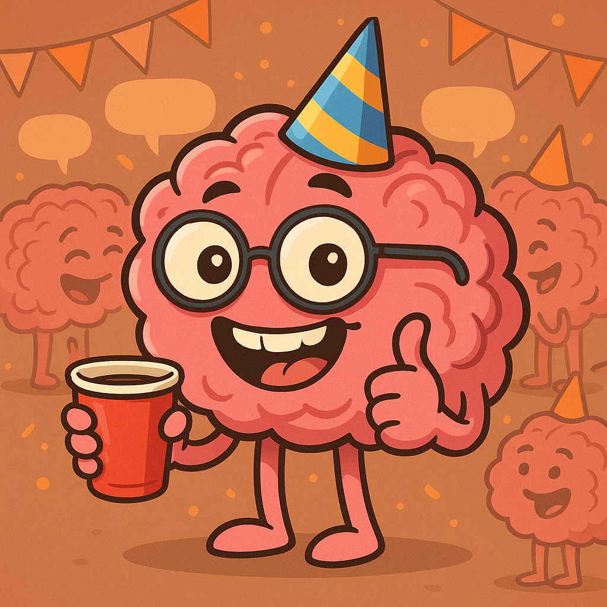

# Michal Zamberg Elad

## 🧡 About Me
My name is Michal, I'm a PhD student at Ramot's Lab in the Department of Brain Sciences at the Weizmann Institute. 
I research Social Cognition in humans using eyetracking and fMRI in oreder to have better understanding of social deficitis and try implement Neurofeedback methods in Autistic population.

